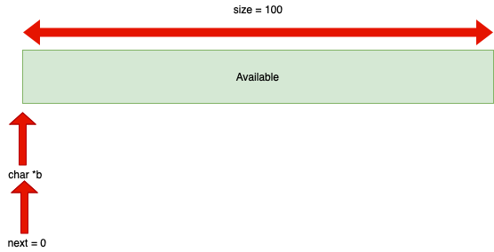
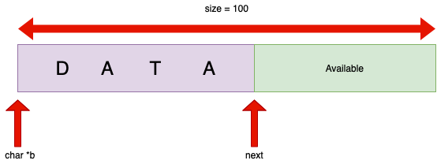

# DataSerialization
Data (De)Serialization

**Data Serialization** is a mechanism to transform the program's internal data structure into a form that could be sent to a remote machine over the network.
**Data (De)Serialization** helps in making data exchange between processes running on heterogeneous machines independent of underlying OS, Compiler, Programming Language, Hardware and the like.

```
struct student_t {
  char name[30];
  int id;
  int no;
};
```

The memory layout for the above code is way more different in different architectures. So, without data (de)Serialization, it is impossible to have communication between heterogeneous machines.

Note that, Data (De)Serialization is one of the most important building block of various system programming concepts such as: RPC, State Synchronization, Check Pointing the application state.

Data Serialization deletes data structures pads in which compiler adds. In the above code, the memory layout of the structure is somehow different with the its actual memory footprint. There are nested structures in some programs which contains pointer to the child's structure. In this case, when the data is serialized, the pointer is translated to 0xF...FF . This is called **Sentinel** value. During deserialization, when we encounter the Sentinel value in the serialized object, we know that this field was set to NULL in the original object.
Data Serialization is done in 3 condition:

1) Simple C structures

2) C structure with nested C sub-structure

3) C structure with pointer members

Data Serialization/deserialization is all about removing and adding padding bytes in the data structure memory footprint with the help of **Compiler**. So, it's important to know that the compiler involves in both processes and the programmer does not explicitly add the padding bytes.


| StructureName  |     Serialization Routine     |   Deserialization Routine   |
|----------------|-------------------------------|-----------------------------|
|  Person_t      |void serialize_person_t(person_t \*obj, ser_buff_t \*b);|person_t* de_serialize_person_t(ser_buff_t* b);|          |  Company_t     |void serialize_company_t(company_t \*obj, ser_buff_t \*b);|company_t* de_serialize_company_t(ser_buff_t* b);|

For every structure, we need to perform its serialization on sending process and deserialization on receiving process. Serialized data is a flat structure which means it contains no pointers, no padding bytes or any hierarchical metadata.

There is a data structure called **STREAM** which makes use of serialization of data easy. It is useful in situation when there is a need to collect or append data one after another incrementally just like OSI layer headers in a packet one after another. It helps in copying the bytes into a buffer, as well as reading the bytes from the buffer very easy and handy. This data structure is a flexible buffer which grows automatically when run out of space. The below piece of codes are an example of serializing and de-serializing data:
```
typedef struc serialized_buffer{
  char *data; //points to the start of the memory buffer which stores the content
  int size; //size of the serialized buffer
  int next; //bytes position in serialized buffer where next data item will be written into or read from.
}ser_buff_t;

void init_serialized_buffer(ser_buff_t **data){
  (*data) = (ser_buff_t*)calloc(1, sizeof(ser_buff_t));
  (*data)->data = calloc(1, SERIALIZE_BUFFER_DEFAULT_SIZE); //Let's say 100
  (*data)->size = SERIALIZE_BUFFER_DEFAULT_SIZE;
  (*data)->next = 0;
}
.
.
.
 Usage:
ser_buff_t *stream;
init_serialized_buffer(&stream);
```


After invoking ```init_serialized_buffer```, there is a serialized buffer which is in its initial state created. The pointer points to the beginning of the buffer and ```next``` indicates that new data should be added right after that.

Further step is to add data into a serialized buffer. Below you can see functions and APIs to do such thing:
```
void serialize_data(ser_buff_t *buff, char *data, int nbytes){
  int available_size = buff->size - buff->next;
  char isResize = 0;
  while(available_size < nbytes){
    buff->size = buff->size*2;
    available_size = buff->size - buff->next;
    isResize = 1;
  }
  if(isResize == 0){
    memcpy((char*)buff->data + buff->next, data, nbytes);
    buff->next += nbytes;
    return;
  }
  buff->data = realloc(buff->data, buff->size);
  memcpy((char*)buff->data + buff->next, data, nbytes);
  buff->next += nbytes;
}
```


Note that, ```realloc()``` changes the size of the memory while preserving the content of it. So if the size of the new data to be added is more than available space (```available_size```), then the function doubles the buffer size and preserves the previous data and then adds new data in a serialized manner.
