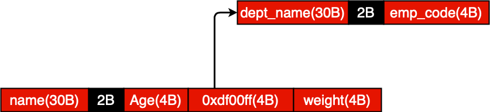
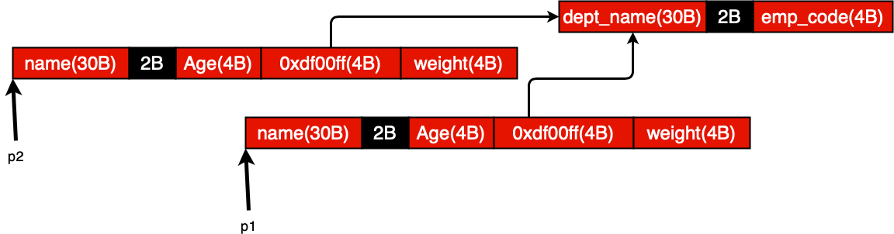
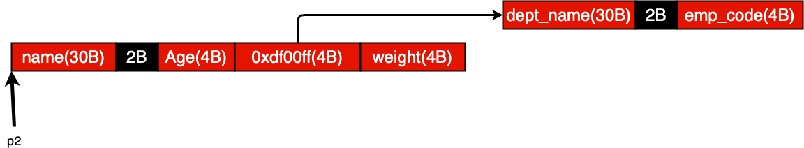
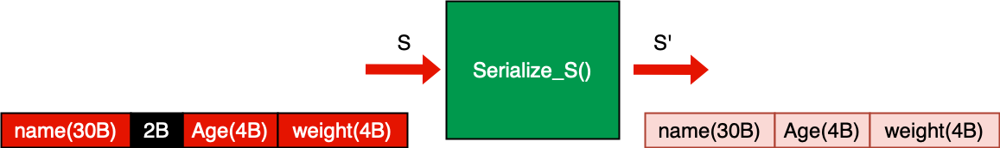

In this file, you'll find APIs for serializing and de-serializing defined data structure. In fact, any data structure we define to serialize, the serializer and de-serializer APIs associated with that data structure should be implemented. But before that, there are a few C terminologies we have to review.

Suppose there are two data structures as below:
```
struct occupation_t{
  char dept_name[30];
  int employee_code;
};

struct person_t{
  char name[30];
  int age;
  struct occupation_t *occ;
  int weight;
};
```
The memory footprint for the above nested data structure is like below:



So there is a parent-child relationship between person object and occupation object. Suppose there is a pointer ```p1``` which points to the person object as we see below. Also, we define another pointer called ```p2``` to point to the another new created person object.
```
struct person_t *p1; //pointing to object in memory
struct person_t *p2 = calloc(1, sizeof(person_t));
```


After doing an operation which is called **shallow copy**, the memory footprint will look like below:

```
*p2 = *p1; // shallow copy
```


All the fields of p1 are copied to re respective fields of p2. Important thing to note is that after shallow copy, there are two references to child object. Shallow copy refers to the copying fields of an object without re-producing any new internal object. After freeing let's say ```p1```, the memory footprint will look like this:
```
free(p1); //shallow free
```


So, as we see, we never re-created occupation object, and only duplicated the person object.

---
There are another two common C terminologies which is worth reviewing:

```
struct person_t{
  char name[30];
  int age;
  struct occupation occ;   /*This is called Embedded Structure */
  struct qualification *q; /*This is called pointer member */
  int weight;
};
```

## The Implementation of Data Serialization
Suppose we have defined a data structure like below:
```
struct person_t{
  char name[30];
  int age;
  int weight;
};
```
By creating an object of type ```person_t``` in memory with ```malloc``` or ```calloc```, the object will look like this:


and let's say the object name is S. We define a function called ```serialize_s()``` to create serialized version of S, called that S'.



As a result, there won't be any padding bytes in serialized data. So, this function needs a serialized buffer which is ```NULL``` at the beginning.

```
ser_buffer_t *b = NULL;
init_serialized_buffer(&b);

void serialized_person_t(person_t *obj, ser_buffer_t *b){
  if(!obj){
    unsigned int sentinel = 0xFFFFFFFF;
    serialize_data(b, (char*)&sentinel, sizeof(unsigned int));
    return;
  }
  serialize_data(b, (char*)obj->name, strlen(name)*sizeof(char));
  serialize_data(b, (char*)&obj->age, sizeof(int));
  serialize_data(b, (char*)&obj->weight, sizeof(int));
}
```
At first, we have to check if the amount of object is ```NULL```. If so, then the amount of serialized NULL should be ```0xFFFFFFFF``` because of ***sentinel*** concept. So, according to above code, let's rule some conventions for Data Serialization:

1. For a given structure S, signature of serialize routine will be:
```
void serialize_S(S *obj, ser_buffer_t *b);
```
2. The ```serialize_data()``` to be used for primitive data types should be writte as:
```
serialize_data(b, (char*)&obj-><filed Name>, sizeof(<field Data Type>)); /* if field is not array */
serialize_data(b, (char*)obj-><filed Name>, sizeof(<field Data Type>)*arry_Size); /* if field is array */
```

In further implementation, there is an embedded structure within a parent structure just like below:
```
struct person_t{
  char name[30];
  int age;
  struct occupation_t occ;
  int weight;
};

struct occupation_t{
  char dept_name[30];
  char employee_code;
};
```
The memory footprint for the object representing structure person_t is like below:


So, serializaing above abject should be like below:

```
void serialized_person_t(person_t *obj, ser_buffer_t *b){
  if(!obj){
    unsigned int sentinel = 0xFFFFFFFF;
    serialize_data(b, (char*)&sentinel, sizeof(unsigned int));
    return;
  }
  serialize_data(b, (char*)obj->name, sizeof(char)*strlen(name));
  serialize_data(b, (char*)&obj->age, sizeof(int));
  serialized_occupation(obj->occ, b);
  serialize_data(b, (char*)&obj->weight, sizeof(int));
}
```
For serializing data structure with pointer element in it as below:
```
struct person_t{
  char name[30];
  int age;
  struct occupation_t *occ;
  int weight;
};

struct occupation_t{
  char dept_name[30];
  char employee_code;
};
```
we shall implement such code like this:

```
void serialized_person_t(person_t *obj, ser_buffer_t *b){
  if(!obj){
    unsigned int sentinel = 0xFFFFFFFF;
    serialize_data(b, (char*)&sentinel, sizeof(unsigned int));
    return;
  }
  serialize_data(b, (char*)obj->name, sizeof(char)*strlen(name));
  serialize_data(b, (char*)&obj->age, sizeof(int));
  serialize_occupation_t(obj->occ, b);
  serialize_data(b, (char*)&obj->weight, sizeof(int));
}
```
## The Implementation of Data De-Serialization
straight to the point!
```
person_t *de_serializer_person_t(ser_buffer_t *b){
  /* sentinel detection code */
  unsigned int sentinel = 0;
  de_serialize_data((char*)&sentinel, b, sizeof(unsigned int));
  if(sentinel == 0xFFFFFFFF){
    return NULL;
  }
  serialize_buffer_skip(b, -1 * sizeof(unsigned int));

  /* de-serialization routine */
  person_t *obj = calloc(1, sizeof(person_t));
  de_serialize_data((char*)obj->name, b, sizeof(char)*strlen(obj->name));
  de_serialize_data((char*)&obj->age, b, sizeof(int));
  de_serialize_data((char*)&obj->weight, b, sizeof(int));
  return obj;
}
```
The program should check if the first 4 bytes of the serialized buffer is ```0xFFFFFFFF```, and if so, the function should return ```NULL```. Otherwise, the function must turn the ```next``` pointer back to the first place with the invocation of ```serialize_buffer_skip``` function. After this stage, we are sure that the serialized buffer is not null and ```de_serializer_person_t``` must start de-serialization routine.

De-Serialization conventions:

1. For a given structure S, signature of deserializer routine will be :
```
S* de_serialize_S(ser_buffer_t *b);
```
2. The de_serialize_data should be written as:
```
de_serialize_data((char*)&obj-><Field Name>, b, sizeof(Field Data Type)); /* if field is not an array */
de_serialize_data((char*)obj-><Field Name>, b, sizeof(Field Data Type)*array_size; /* if field is an array */
```

**De-Serializing Nested Structures**:
According to below data structure, deserialization function will be as below:
```
struct person_t{
  char name[30];
  int age;
  struct occupation_t occ;
  int weight;
};

struct occupation_t{
  char dept_name[30];
  char employee_code;
};

person_t *de_serializer_person_t(ser_buff_t *b){
  /* sentinel detection code */
  unsigned int sentinel = 0;
  de_serialize_data((char*)&sentinel, b, sizeof(unsigned int));
  if(sentinel == 0xFFFFFFFF){
    return NULL;
  }
  serialize_buffer_skip(b, -1 * sizeof(unsigned int));

  person_t *obj = calloc(1, sizeof(person_t));
  de_serialize_data((char*)obj->name, b, sizeof(char)*strlen(obj->name));
  de_serialize_data((char*)&obj->age, b, sizeof(int));
  struct occupation_t *occ = de_serialized_occupation_t(b);
  obj->occ = occ; /* shallow copy. No need to copy each element, if any. */
  free(occ); // shallow free
  de_serialize_data((char*)&obj->weight, b, sizeof(int));
  return obj;
}
```
**De-Serializing Pointer Structures**:
```
struct person_t{
  char name[30];
  int age;
  struct occupation_t *occ;
  int weight;
};

struct occupation_t{
  char dept_name[30];
  char employee_code;
};

person_t *de_serializer_person_t(ser_buff_t *b){
  /* sentinel detection code */
  unsigned int sentinel = 0;
  de_serialize_data((char*)&sentinel, b, sizeof(unsigned int));
  if(sentinel == 0xFFFFFFFF){
    return NULL;
  }
  serialize_buffer_skip(b, -1 * sizeof(unsigned int));

  person_t *obj = calloc(1, sizeof(person_t));
  de_serialize_data((char*)obj->name, b, sizeof(char)*strlen(obj->name));
  de_serialize_data((char*)&obj->age, b, sizeof(int));
  obj->occ = de_serialized_occupation_t(b);
  de_serialize_data((char*)&obj->weight, b, sizeof(int));
  return obj;
```
The main pitfall in this system is de-serialization part. In fact, de-serialization function is not able to distinguish between these two data structures:

1. When the pointer member of the parent structure is NULL.
```
struct person_t{
  char name[30];
  int age;
  struct occupation_t *occ = NULL;
  int weight;
};
```
2. When the first member of the nested structure is NULL.
```
struct person_t{
  char name[30];
  int age;
  struct occupation_t *occ;
  int weight;
};
struct occupation_t{
  struct work_ext_t = NULL;
  char office_address[30];
};
```

The solution is that the first member of the internal object (pointed by pointer member field) should not be pointer member. So, Avoid it. 
