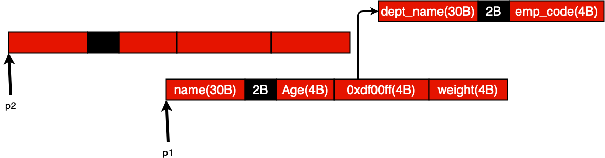

In this file, you'll find APIs for serializing and de-serializing defined data structure. In fact, any data structure we define to serialize, the serializer and de-serializer APIs associated with that data structure should be implemented. But before that, there are a few C terminologies we have to review.

Suppose there are two data structures as below:
```
struct occupation_t{
  char dept_name[30];
  int employee_code;
};

struct person_t{
  char name[30];
  int age;
  struct occupation_t *occ;
  int weight;
};
```
The memory footprint for the above nested data structure is like below:


So there is a parent-child relationship between person object and occupation object. Suppose there is a pointer ```p1``` which points to the person object as we see below. Also, we define another pointer called ```p2``` to point to the another new created person object.
```
struct person_t *p1; //pointing to object in memory
struct person_t *p2 = calloc(1, sizeof(person_t));
```


After doing an operation which is called **shallow copy**, the memory footprint will look like below:

```
*p2 = *p1; // shallow copy
```


All the fields of p1 are copied to re respective fields of p2. Important thing to note is that after shallow copy, there are two references to child object. Shallow copy refers to the copying fields of an object without re-producing any new internal object. After freeing let's say ```p1```, the memory footprint will look like this:
```
free(p1); //shallow free
```


So, as we see, we never re-created occupation object, and only duplicated the person object.

---
There are another two common C terminologies which is worth reviewing:

```
struct person_t{
  char name[30];
  int age;
  struct occupation occ;   /*This is called Embedded Structure */
  struct qualification *q; /*This is called pointer member */
  int weight;
};
```
